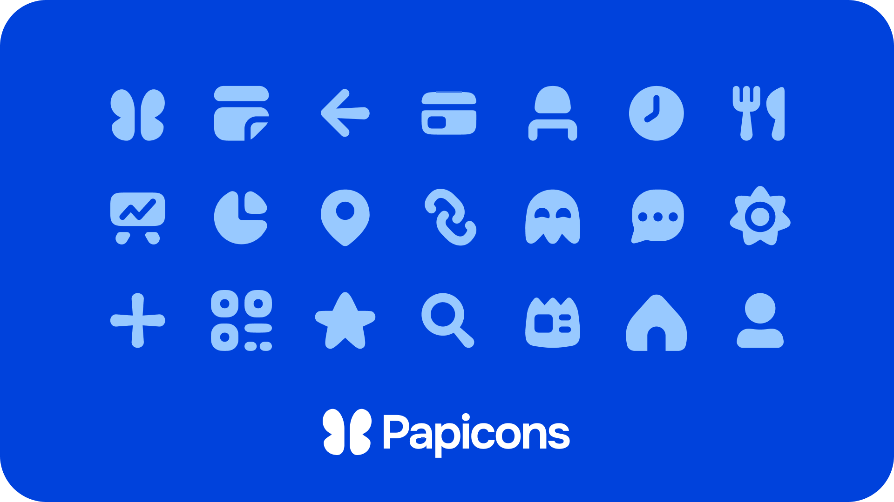

# 🏗️ Architecture

## Résumé

Papillon utilise la version 53 d'Expo et la 0.79.5 de React Native pour fonctionner. Nous nous reposons aussi sur de nombreuses librairies, la liste est disponible ici. Notre architecture est découpée en plusieurs couches :

* Librairies et communications réseaux
* Papillon UI
* Papillon Icons
* Stockage des données

## Librairies et communications

**Papillon** n’utilise **aucun serveur intermédiaire** pour récupérer les données scolaires de l’utilisateur : elle s’appuie directement sur diverses **librairies open source** pour interagir avec les services.

Cette approche est rendue possible **en grande partie** grâce au travail de l’organisation [**LiterateInk**](https://literate.ink/), qui maintient plusieurs des **principales** librairies utilisées par Papillon, telles que [**Pawnote**](https://github.com/LiterateInk/Pawnote), [**Pawdirecte**](https://github.com/LiterateInk/Pawdirecte.js) ou [**PawRD**](https://github.com/LiterateInk/PawRD). D’autres librairies externes, provenant d’autres **développeurs** et **contributeurs**, participent également à la **magie** de **Papillon**.

Grâce à plusieurs phases de **rétroingénierie**, nous avons pu reproduire fidèlement le comportement des applications **officielles**, tout en permettant une approche plus **ouverte**, **transparente** et **respectueuse de la vie privée**. Pour mieux visualiser ce fonctionnement, voici un **schéma comparatif** entre les **applications officielles** et **Papillon**.

<figure><figcaption></figcaption></figure>

<figure><figcaption></figcaption></figure>

**Et si vous en faisiez partie ?** C’est grâce à la **communauté open source** que Papillon existe et continue de grandir. Si vous souhaitez **intégrer votre service à Papillon**, nous serions ravis d’accueillir votre **librairie** et de collaborer avec vous pour enrichir l’application.

## Papillon UI

Avant d’atteindre une **maturité suffisante**, les composants de **Papillon UI** sont développés directement au sein du [dépôt GitHub](https://github.com/PapillonApp/Papillon) de **Papillon V8**. À terme, cette librairie deviendra un **dépôt distinct** et réutilisable par tous les développeurs, que ce soit pour des projets **internes** ou **externes** à **Papillon**.

Il est **essentiel** de suivre **rigoureusement** les designs disponibles sur le **Figma** de **Papillon**, afin de garantir une **cohérence visuelle** et **fonctionnelle** dans l’interface. Cette rigueur permet de **préserver** l’identité de **Papillon** tout en assurant une expérience utilisateur homogène à mesure que l’interface **s’agrandit et évolue**.


**Une question sur l'interface ?** Nous serions ravies d'y répondre dans le salon `🎨┃・interfaces` du serveur [Discord de Papillon](https://discord.gg/aKhYSBSzgW)


## Papillon Icons

Cette année, **Papillon** se renouvelle avec une **nouvelle identité visuelle**, nous continuons d’utiliser une partie des [**Lucide Icons**](https://lucide.dev/icons/), mais privilégions désormais les superbes icônes créées par [**Tom Things**](https://www.linkedin.com/in/tom-heliere/), designer chez **Papillon**.

Ces icônes sont disponibles via la librairie NPM [**Papicons**](https://www.npmjs.com/package/@getpapillon/papicons), qui bénéficie de mises à jour **régulières**. Nous invitons donc les contributeurs à **privilégier** l’usage des icônes de cette librairie dans leurs PRs.

<figure><figcaption></figcaption></figure>

## Stockage des données


**Papillon** respecte pleinement le **RGPD (Règlement Général sur la Protection des Données)**. **Aucune** donnée personnelle n’est traitée automatiquement sur nos serveurs : vos données **vous appartiennent** et **restent** strictement stockées **sur votre appareil**.


Depuis la **version 8** de **Papillon**, nous avons remplacé [**AsyncStorage**](https://docs.expo.dev/versions/latest/sdk/async-storage/) par plusieurs solutions de stockage **plus performantes** afin de garantir un **accès rapide** aux données, aussi bien **en ligne** que hors **ligne**. Nous utilisons notamment **deux librairies** principales :

1. [**MMKV**](https://github.com/mrousavy/react-native-mmkv): une solution **ultrarapide** de stockage **clé-valeur**, jusqu’à **20 fois** plus rapide qu'**AsyncStorage**, chez Papillon, nous l'utilisons pour stocker les données critiques comme les comptes ou encore les flags (nécessaires pour activer certaines fonctionnalités).
2. [**WatermelonDB**](https://github.com/Nozbe/WatermelonDB): une base de données locale ultra-optimisée pour les performances, bien plus rapide aussi qu'**AsyncStorage**, elle est utilisée lorsque l'appareil de l'utilisateur n'a pas accès à Internet, c'est lui qui sert de cache.

Afin de fluidifier les différents flux de données reçus par les services, nous utilisons des interfaces partagées, auxquelles chaque donnée renvoyée par un service doit se conformer, c'est d'ailleurs ce que font les fichiers contenus dans `database/mappers`.
