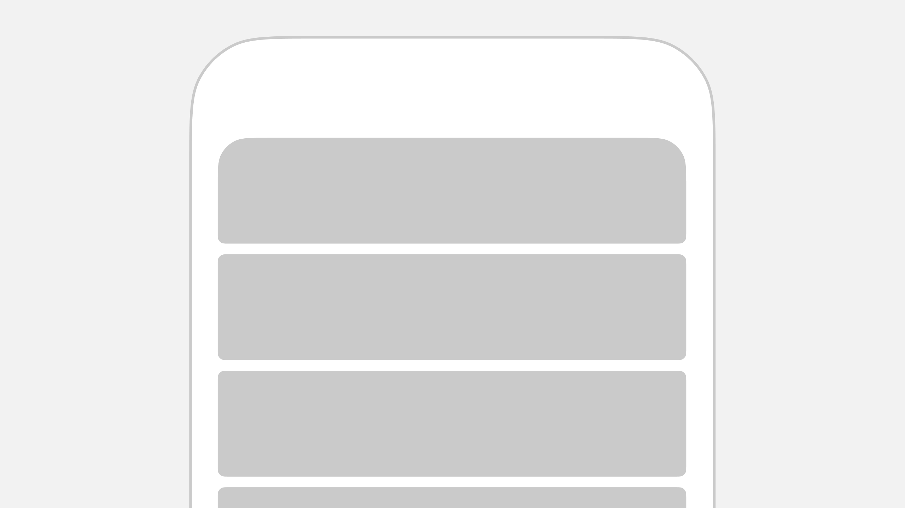

# Stack

Stack permet de créer facilement des assemblages de vues, alignées et réparties équitablements, à la manière de **l'Auto Layout** de Figma ou du **Flexbox** en CSS.

<figure><picture><source srcset="../../.gitbook/assets/image (1).png" media="(prefers-color-scheme: dark)"></picture><figcaption></figcaption></figure>

## Exemple

Cet exemple aligne 3 titres H2 verticalement avec un espacement de 12 pixels



<pre class="language-tsx" data-title="example.tsx" data-line-numbers><code class="lang-tsx"><strong>&#x3C;Stack
</strong><strong>  direction="vertical"
</strong><strong>  gap={12}
</strong><strong>>
</strong>  &#x3C;Typography variant="h2">
    Hey
  &#x3C;/Typography>
  &#x3C;Typography variant="h2">
    Comment
  &#x3C;/Typography>
  &#x3C;Typography variant="h2">
    Ça va
  &#x3C;/Typography>
<strong>&#x3C;/Stack>
</strong></code></pre>



<figure><picture><source srcset="../../.gitbook/assets/image (4).png" media="(prefers-color-scheme: dark)"></picture><figcaption></figcaption></figure>



## Propriétés


Stack étend [**View**](https://reactnative.dev/docs/view) et dispose de toutes ses propriétés


### `direction`

Direction de l'alignement des éléments :

* `horizontal`
* **`vertical` (par défaut)**

| Type   | Valeur par défaut |
| ------ | ----------------- |
| String | vertical          |

### `gap`

Espacement entre les éléments

| Type   | Valeur par défaut |
| ------ | ----------------- |
| Nombre | 4                 |

### `padding`

Espacement autour des éléments de la Stack

| Type                         | Valeur par défaut |
| ---------------------------- | ----------------- |
| Nombre ou `[Nombre, Nombre]` | 0                 |

### `margin`

Espacement au dehors des éléments de la Stack

| Type   | Valeur par défaut |
| ------ | ----------------- |
| Nombre | 0                 |

### `vAlign`

Alignement vertical à l'intérieur de la Stack

| Type                       | Valeur par défaut |
| -------------------------- | ----------------- |
| `start`, `center` ou `end` | start             |

### `hAlign`

Alignement horizontal à l'intérieur de la Stack

| Type                       | Valeur par défaut |
| -------------------------- | ----------------- |
| `start`, `center` ou `end` | start             |

### `inline`

Empêche la Stack de prendre toute la largeur

| Type    | Valeur par défaut |
| ------- | ----------------- |
| Booléen | false             |

### `flex`

Applique `flex: 1` a la Stack

| Type    | Valeur par défaut |
| ------- | ----------------- |
| Booléen | false             |

### `backgroundColor`

Applique une couleur de fond à la Stack

| Type   |
| ------ |
| String |

### `radius`

Valeur d'arrondi de la stack

| Type   | Valeur par défaut |
| ------ | ----------------- |
| Nombre | 0                 |

### `card`

Transforme la stack en une Carte similaire a une [`<List />`](../list.md)


Cette propriété en overwrite d'autres par défaut telles que `backgroundColor` ou `radius`.


| Type    | Valeur par défaut |
| ------- | ----------------- |
| Booléen | false             |

### `flat`

Désactive les `ombres` lorsque card est actif.

| Type    | Valeur par défaut |
| ------- | ----------------- |
| Booléen | false             |
