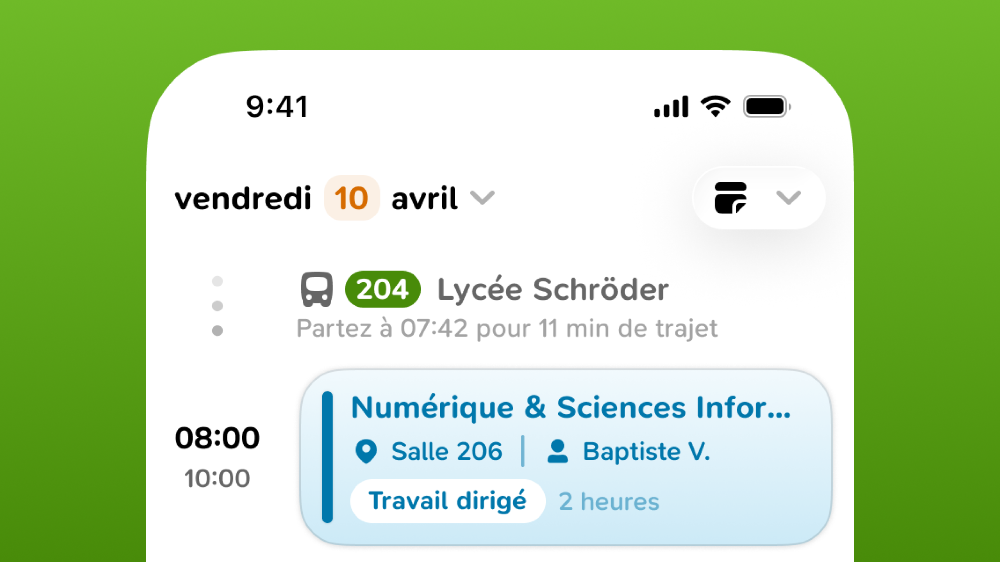

# 🤝 Partenaires de Papillon

Pour proposer plus de fonctionnalités pertinentes, **Papillon peut faire appel à des partenaires externes** dans le but de fournir un service qui n'est pas maintenu par l'équipe de développement.

Lorsque c'est le cas, une mention "fourni par ..." ou "avec ..." est affichée pour permettre l'identification du partenaire concerné.



<figure><figcaption>
Fiches de révision avec <strong>Knowunity</strong>
</figcaption></figure>



<figure><figcaption>
Transports en commun avec <strong>Transit</strong>
</figcaption></figure>




## Ces intégrations sont désactivables si vous le souhaitez.

Vos données ne sont pas utilisées à des fins de suivi, de tracage publicitaire ou d'analyse en dehors de la politique de confidentialité de Papillon. De la même manière, **aucune donnée personnelle n'est transmise vers l'extérieur** sans votre consentement éclairé.


**Il ne s'agit pas de publicités ou d'intégrations à but lucratif.** Papillon ne gagne pas d'argent avec ces fonctionnalités et celles-ci s'organisent autour d'accord communs avec des entreprises ou des associations fournissant gratuitement un service pour Papillon et sa communauté.

